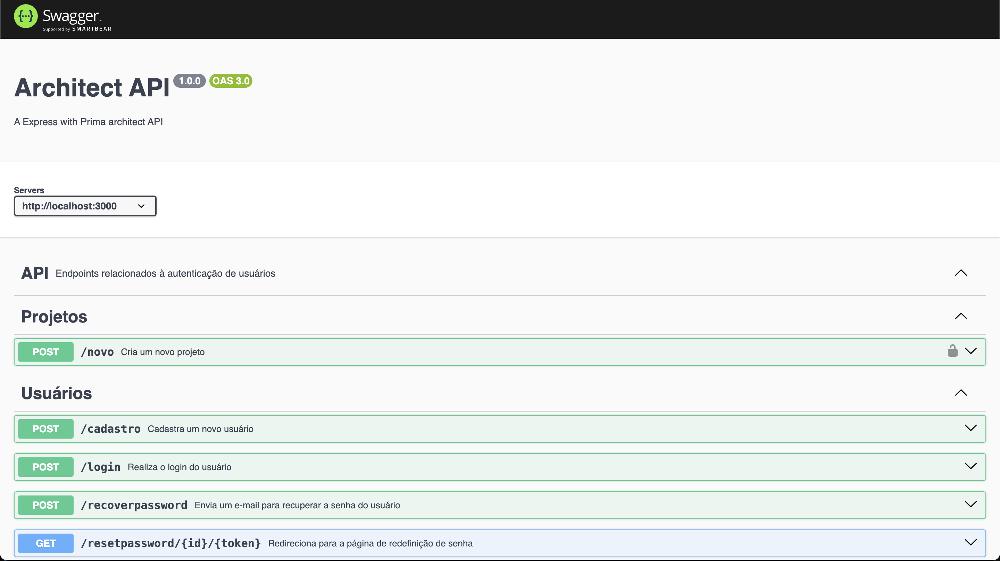

# API Arquitetos - JDG

## Descrição

Bem-vindo ao projeto API Arquitetos - JDG! Esta API foi desenvolvida para oferecer uma plataforma amigável e eficiente para arquitetos gerenciarem seus projetos e informações pessoais. Com recursos de autenticação, cadastro, recuperação de senha, adição de projetos e atualização de dados pessoais, o API Arquitetos - JDG é uma ferramenta completa para profissionais da arquitetura.
O banco de dados possui as tabelas Arquiteto e Projeto, que possuem colunas relativas às informações essenciais sobre os arquitetos e sobre os projetos.

## Tecnologias Utilizadas

O projeto foi construído utilizando as seguintes tecnologias:

- **Node.js**: Ambiente de execução JavaScript server-side.
- **TypeScript**: Superset do JavaScript que adiciona tipagem estática.
- **Swagger**: Framework para documentação de APIs.
- **Express**: Framework web para Node.js.
- **MySQL**: Sistema de gerenciamento de banco de dados relacional.
- **Prisma**: Tipo de ORM (Object-Relational Mapping).

## Como Usar

Antes de começar, certifique-se de ter o [Node.js](https://nodejs.org/) instalado em sua máquina.

1. Clone o repositório:

   ```bash
   git clone https://github.com/Juniors-Developers-Group-JDG/API-Back-End-.git
   ```

2. Acesse o diretório do projeto:

   ```bash
   cd API-Back-End-
   ```

3. Instale as dependências:

   ```bash
   npm install
   ```

4. Execute o projeto:

   ```bash
   npm run dev
   ```

Agora, a API estará em execução localmente. Você pode acessar a documentação da API usando o Swagger em [http://localhost:3000/api-docs](http://localhost:3000/api-docs).


Lembre-se de configurar corretamente as variáveis de ambiente para a conexão com o banco de dados MySQL antes de iniciar o projeto. Você pode fazer isso criando um arquivo `.env` no diretório raiz do projeto e adicionando as informações necessárias.

Divirta-se utilizando o API Arquitetos - JDG! Se tiver dúvidas ou sugestões, sinta-se à vontade para entrar em contato.
